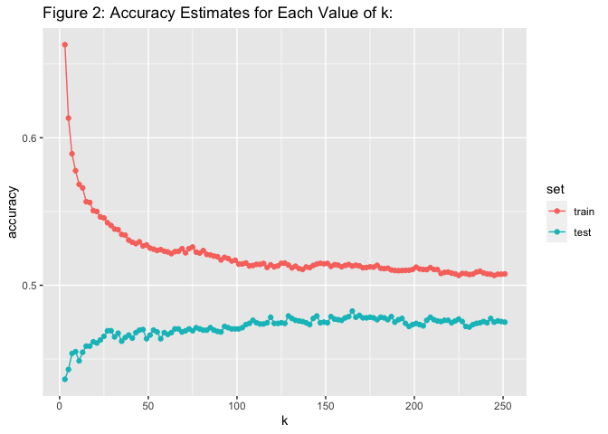

BST 260 Final Project: Comparing KNN and Multinomial Regression Methods
to Predict Diabetes
================
Veda Sripada
2022-12-16

# Introduction and Background

Type II diabetes is a multifaceted disease, and a diagnosis is often
influenced by a combination of individual’s lifestyle choices as well as
various health indicators. A diabetes diagnosis is often preceded by
prediabetes, and those diagnosed with prediabetes are at heightened risk
of developing type II diabetes. To explore this phenomenon, I aim to use
various regression and machine learning techniques to predict an
individual’s stage of diabetes (no diabetes, prediabetes or type II
diabetes) using a motley of health-related lifestyle indicators.

The dataset I am using is a pre-processed (cleaned) diabetes health
indicator dataset. I will be using the diabetes \_ 012 \_ health \_
indicators BRFSS2015.csv dataset with 21 predictor variables, 253,680
survey responses to the CDC’s BRFSS2015. The target variable
Diabetes_012 has 3 classes. 0 denotes no diabetes or only during
pregnancy, 1 denotes prediabetes, and 2 denotes diabetes. The
description notes that there is “class imbalance in this dataset meaning
that there is an unequal distribution of classes in the dataset.
Exploratory data analysis reveals that there is no missingness in the
data (all cases are complete cases), and that there are a higher number
of nondiabetics and fewest number of prediabetics. Table 1 depicts this
phenomenon: (only 4631 compared to tens/hundreds of thousands of
observations in the other two categories), and overall, the dataset is
quite unbalanced.

Training any sort of machine learning model on an unbalanced dataset can
lead to inaccurate predictions, so prior to modeling, I created a new
dataset by randomly sampling 4000 rows from the existing data to create
a new, balanced dataset with 12000 observations total. Table 2 shows the
balanced nature of this new dataset. Since our dataset now is balanced,
we can equally weight sensitivity and specificity, and use accuracy to
quantify model performance.

As a preliminary analysis measure, I binarized the outcome to only 0 (no
diabetes) and 1 (diabetes = 2), with the goal of comparing calculated
probabities of having diabetes to the observed probabilities (proportion
of 1s). After estimating the probabilities, I binned them and compared
this to the proportion of 1s for each bin. I expect that the proportion
of 1s in the dataset will increase as the binned probabilities increase.

Using a kNN model and an 80/20 testing/training split, I predicted the
category of the outcome and compare the accuracy to a multinomial
regression model, which we use due to the categorical nature of our
outcome, without assuming proportional odds or any type of ordinality.
For the multinomial regression model, I will use forwards selection to
find the best subset of covariates to use. Ultimately, the goal is to
use the given predictors in a meaningful way to accurately predict the
stage of diabetes, so that patients and providers can have a strong
understanding of their health status and come up with a treatment plan
(or preventitive care) appropriately with regard to their stage of
diabetes.

# Results

## Preliminary Analysis: Probability of Diabetes vs No Diabetes

For the preliminary analysis, I built a logistic regression model using
forwards selection.Forward selection begins with the most basic model, a
single predictor, and continuously adds predictors that best improves
the model, until a final model is reached (that is, no further
improvement can be attained). The results of this step show that **all**
21 covariates included in the dataset were necessary to best model the
effect of the predictors on diabetes.

Next, I used the cut() function to bin the estimated probabilities, and
plotted the resulting values against the observed probabilities. Figure
1 shows the plot of observed probabilities vs the estimated (binned)
probabilities. From this plot, we can see that as the estimated
probability increases, the proportion of 1s also increases, showing that
there is a positive association between our association between a higher
bin value and the proportion of 1s in the dataset.

## Multinomial Regression and Forwards Selection

First, I used multinomial logistic regression to model the categorical
outcome variable: diabetes stage. In this type of regression, the
resulting covariate estimates are the log odds of the outcome stages.
This approach allows for comparison of various coefficients for risk
factors across all categories with no diabetes (diabetes = 0) as the
reference (baseline) category. This model was trained using the training
set created in the split, which contains 80% of the balanced data.

Since there exist a large number of covariates in this dataset, I first
employed a forwards selection procedure to investigate whether the
relationship between the predictors and diabetes outcome can be
meaningfully modeled using a fewer number of covariates. Similar to the
preliminary analysis, the forwards selection procedure showed that
**all** 21 covariates included in the dataset were necessary to best
model the effect of the predictors on diabetes. This means that each
covariate improved the model sufficiently to warrant inclusion in the
final model. The final model is:

log(p(diabetes category k)/p(diabetes category 0)) = B0 + B1\* HighBP +
B2 \* HighChol + B3 \* CholCheck + B4 \* BMI + B5 \* Smoker + B6 \*
Stroke + B7 \* HeartDiseaseorAttack + B8 \* PhysActivity + B9 \*
Fruits + B10 \* Veggies + B11 \* HvyAlcoholConsump + B12 \*
AnyHealthcare + B13 \* “NoDocbcCost + B14 \* GenHlth + B15 \* MentHlth +
B16 \* PhysHlth + B17 \* DiffWalk + B18 \* Sex + B19 \* Age + B20 \*
Education + B21 \* Income, where the outcome is the risk ratio of being
in outcome level k.

Using the predict() function, we create estimates of the outcome (risk
ratio of being in diabetes category k) as a linear combination of the
covariates. Using the ConfusionMatrix() function, we obtain an estimate
of the model’s accuracy on the train set, which is **0.528125**. Table 3
highlights more detailed output from the confusion matrix: sensitivity
(true positive rate) and accuracy are highest for class 0 and lowest for
class 1. Interestingly, the specificity (true negative rate) is highest
for class 1. Table 5 shows a breakdown of the predicted values relative
to the real values: 0s are most often predicted correctly, whereas
stages 1 and 2 are often falsely categorized as the other.

Next, we test the model’s performance on the other 20% of the data also
using the predict() function, which provides an accuracy estimate of
**0.5354167**, which is surprisingly higher than the accuracy on the
training data, which the model was trained on. Table 4 summarizes
important metrics for the model’s performance on the test set. Similar
to the train set results, sensitivity and accuracy are highest for class
0, while specificity is highest for class 1. Table 6 shows the confusion
matrix table. Again, similar to the training data, 0s are most often
predicted correctly, whereas stages 1 and 2 are often falsely
categorized as one other.

## kNN

Next, I implemented a k-nearest neighbors algorithm to predict the
category of diabetes using the given covariates using the knn3()
function in the **caret** package. The kNN algorithm I used uses all the
covariates, without a prior selection feature. Therefore, the model
formulation is diabetes \~. (where all covariates are used).

To select k (the number of neighbors used by the model) and prevent
under and over smoothing, I selected the k that maximizes accuracy by
minimizing the MSE in the test set by iteratively using different
odd-values of k. Figure 2 shows the resulting accuracy estimates in both
the train and test sets: it is evident that the accuracy pertaining to
the train set is always higher than the accuracy estimate pertaining to
the test set, as expected. Similarly, low values of k result in high
accuracy in the test set but low accuracy in the test set due to
overfitting. The k that maximizes accuracy (and minimizes MSE) in the
test set is k = 113, which is what I used to build my model.

Table 7 summarizes the final accuracy estimates for both train and test
sets using the kNN algorithm described above. The final train set
accuracy was **0.5133333** and the final test set accuracy was
**0.4804167.**

## Discussion and Conclusion

Our preliminary analysis demonstrates that the estimated probabilities
calculated using a logistic regression model using the given lifestyle
predictors exhibit a positive correlation with the observed outcome,
diabetes level. This motivates the progression to the next step of the
project: prediction of the level of diabetes using the same predictors
as part of a multinomial model.

Surprisingly, the multinomial regression model outperformed the kNN
algorithm in terms of accuracy in both test and train sets, as depicted
in Table 8. This means that the kNN model had a higher MSE than the
multinomial regression model, and may be attributed to the lack of
predictive power of the covariates. This study reinforces that diabetes
is notoriously hard to predict, especially when only given lifestyle
factors.

It is critical to note that the predictors listed in the dataset are
lifestyle-related. Although some are considered clinical-related (such
as cholesterol checks and the presence or absence of high blood
pressure), these predictors are mainly measured outside of a doctor’s
office. It may be considered that those with certain practices or habits
(such as those who smoke or have high cholesterol) are at a higher risk
for diabetes, these lifestyle factors are highly variable amongst the
general population to the extent that using these to predict diabetes
may not be entirely feasible at this point. For example, a large number
of those with hyperlipedemia or hypertension may not have diabetes, or
even prediabetes, and this pattern can likely be extrapolated to
basically all of the covariates. To extend this project and perhaps
achieve a higher accuracy, a combination of lifestyle factors and
clinically-measurable data (such as hemoglobin A1C levels or blood
glucose levels) can be utilized in a regression or other machine
learning model.

# References

Teboul, Alex. (2021, December). Diabetes Health Indicators Dataset,
Version 1. Retrieved November 15, 2022 from
<https://www.kaggle.com/datasets/alexteboul/diabetes-health-indicators-dataset>

# Appendix (Code)

``` r
#Installing packages
library(tidyverse)
```

    ## ── Attaching packages ─────────────────────────────────────── tidyverse 1.3.2 ──
    ## ✔ ggplot2 3.4.0      ✔ purrr   0.3.5 
    ## ✔ tibble  3.1.8      ✔ dplyr   1.0.10
    ## ✔ tidyr   1.2.1      ✔ stringr 1.4.1 
    ## ✔ readr   2.1.3      ✔ forcats 0.5.2 
    ## ── Conflicts ────────────────────────────────────────── tidyverse_conflicts() ──
    ## ✖ dplyr::filter() masks stats::filter()
    ## ✖ dplyr::lag()    masks stats::lag()

``` r
library(caret)
```

    ## Loading required package: lattice
    ## 
    ## Attaching package: 'caret'
    ## 
    ## The following object is masked from 'package:purrr':
    ## 
    ##     lift

``` r
library(readr)
library(MASS)
```

    ## 
    ## Attaching package: 'MASS'
    ## 
    ## The following object is masked from 'package:dplyr':
    ## 
    ##     select

``` r
library(nnet)
library(purrr)
library(knitr)
```

``` r
library(readr)
data = read_csv("~/Desktop/diabetes_012_health_indicators_BRFSS2015.csv")
#Rename the outcome variable
names(data)[names(data) == "Diabetes_012"] = "diabetes"
```

## Exploratory Data Analysis & Preprocessing

Checking for missingness and for dimensions of the data

``` r
#Missing values
any(is.na(data)) #no missing values
```

    ## [1] FALSE

``` r
dim(data) #253680 observations of 22 predictors/variables
```

    ## [1] 253680     22

``` r
all(complete.cases(data)) #all complete cases
```

    ## [1] TRUE

``` r
data |> group_by(diabetes) |> summarise(n = n()) 
```

    ## # A tibble: 3 × 2
    ##   diabetes      n
    ##      <dbl>  <int>
    ## 1        0 213703
    ## 2        1   4631
    ## 3        2  35346

``` r
#Balancing the dataset
#Create a new dataset with 4000 of each: 0, 1, 2
set.seed(1216) #reproducibility
d0 = sample_n(filter(data, data$diabetes == 0), 4000)
d1 = sample_n(filter(data, data$diabetes == 1), 4000)
d2 = sample_n(filter(data, data$diabetes == 2), 4000)
dat = rbind(d0,d1,d2) #balanced

#Shuffle the data by the rows
dat= dat[sample(1:nrow(dat)), ]
```

Since the outcome we are considering is multinomial in nature (coded as
0, 1 or 2), we use a multinomial linear regression model with
interpretations pertaining to the probabilities of falling into one of
three outcome categories.

## Splitting the Data

First, we use the caret package to partition our data into test and
training sets of equal size.

``` r
set.seed(1216) # reproducibility
y <- dat$diabetes
test_index <- createDataPartition(y, times = 1, p = 0.2, list = FALSE)
train_set <- dat |> slice(-test_index)
test_set <- dat |> slice(test_index)
train_set |> group_by(diabetes) |> summarise(n = n()) #checking for balance
```

    ## # A tibble: 3 × 2
    ##   diabetes     n
    ##      <dbl> <int>
    ## 1        0  3214
    ## 2        1  3186
    ## 3        2  3200

## Method 0.5: Selecting a Logistic Model using Forward Selection

Steps: Binarize the data, select a logistic regression model, estimate
probabilites, and compare it to the observed probabilities (proportion
of 1s) We are binning by the estimated probabilities and computing the
proportion of 1s

``` r
# Split the data into 0 and 2, only
dat1 = dat |> filter(diabetes %in% c(0,2)) 
dat1$diabetes = ifelse(dat1$diabetes == 2, 1, 0) #binarize

#test and train sets
set.seed(1216) # reproducibility
y1 <- dat1$diabetes
test_index1 <- createDataPartition(y1, times = 1, p = 0.2, list = FALSE)
train_set1 <- dat1 |> slice(-test_index)
test_set1 <- dat1 |> slice(test_index)
train_set1 |> group_by(diabetes) |> summarise(n = n()) #checking for balance
```

    ## # A tibble: 2 × 2
    ##   diabetes     n
    ##      <dbl> <int>
    ## 1        0  3169
    ## 2        1  3235

``` r
View(train_set1)

mod1_full = glm(diabetes~., train_set1, family = "binomial") #full model
mod1 = stepAIC(mod1_full, direction = "forward", trace = FALSE) #reduced model, same as full

y_test1 = test_set1$diabetes
probability = predict(mod1, newdata = test_set1, type = "response")
full = as.data.frame(cbind(probability,y_test1))

full |> mutate(probability = cut(probability, breaks = seq(0,1,0.1)))|> group_by(probability) |>
summarize(observed_prob = mean(y_test1 != 0)) |> 
ggplot(aes(probability, observed_prob)) + 
geom_point()
```

<!-- -->

## Method 1: Selecting a Model Using Forward Selection

From the model summary, it is evident that all covariates are necessary
to include in the model to explain variability in the data.

maybe the relationship between all predictors and the outcome arent
linear in the log scale related so this type of regression is not
optimal

``` r
# Full model
full_model = multinom(diabetes~., data = dat)
```

    ## # weights:  69 (44 variable)
    ## initial  value 13183.347464 
    ## iter  10 value 12182.802474
    ## iter  20 value 11717.176475
    ## iter  30 value 11602.667646
    ## iter  40 value 11404.737141
    ## iter  50 value 11376.760473
    ## final  value 11376.760157 
    ## converged

``` r
# Forward selection model
reduced_model <- stepAIC(full_model, direction = "forward", trace = FALSE)
summary(reduced_model)
```

    ## Call:
    ## multinom(formula = diabetes ~ HighBP + HighChol + CholCheck + 
    ##     BMI + Smoker + Stroke + HeartDiseaseorAttack + PhysActivity + 
    ##     Fruits + Veggies + HvyAlcoholConsump + AnyHealthcare + NoDocbcCost + 
    ##     GenHlth + MentHlth + PhysHlth + DiffWalk + Sex + Age + Education + 
    ##     Income, data = dat)
    ## 
    ## Coefficients:
    ##   (Intercept)    HighBP  HighChol CholCheck        BMI      Smoker      Stroke
    ## 1   -4.521322 0.3765874 0.5982997 0.9020618 0.06518329 0.004949167 -0.06111704
    ## 2   -6.884554 0.7649929 0.5794599 1.0109481 0.08111768 0.017263826  0.16434366
    ##   HeartDiseaseorAttack PhysActivity      Fruits      Veggies HvyAlcoholConsump
    ## 1          -0.06747324  -0.03420356  0.03592712 -0.078765864        -0.1504237
    ## 2           0.18243758  -0.07333058 -0.01089517  0.006802488        -0.8446264
    ##   AnyHealthcare NoDocbcCost   GenHlth     MentHlth     PhysHlth    DiffWalk
    ## 1  -0.240911319   0.5119618 0.3136546  0.006775472 0.0004837625 -0.04965839
    ## 2  -0.003108548   0.2018304 0.5861674 -0.004341033 0.0023810575  0.05988266
    ##          Sex       Age   Education      Income
    ## 1 0.09748927 0.1531426 -0.05263051 -0.07574224
    ## 2 0.23646940 0.1706059 -0.01621615 -0.07621482
    ## 
    ## Std. Errors:
    ##   (Intercept)     HighBP   HighChol CholCheck         BMI     Smoker    Stroke
    ## 1   0.3000248 0.05334160 0.05113823 0.1812366 0.004299702 0.05098516 0.1229343
    ## 2   0.3446207 0.05716589 0.05410568 0.2220266 0.004430158 0.05371204 0.1196526
    ##   HeartDiseaseorAttack PhysActivity     Fruits    Veggies HvyAlcoholConsump
    ## 1           0.08268907   0.05830830 0.05273772 0.06353361         0.1120664
    ## 2           0.08126838   0.06041944 0.05546100 0.06661037         0.1417563
    ##   AnyHealthcare NoDocbcCost    GenHlth    MentHlth    PhysHlth   DiffWalk
    ## 1     0.1211805  0.09268989 0.03029020 0.003482717 0.003337444 0.07348740
    ## 2     0.1366109  0.10015965 0.03249714 0.003665858 0.003380392 0.07406918
    ##          Sex        Age  Education     Income
    ## 1 0.05120950 0.01019160 0.02732835 0.01398900
    ## 2 0.05423005 0.01114689 0.02867225 0.01466293
    ## 
    ## Residual Deviance: 22753.52 
    ## AIC: 22841.52

``` r
coefficients(reduced_model)
```

    ##   (Intercept)    HighBP  HighChol CholCheck        BMI      Smoker      Stroke
    ## 1   -4.521322 0.3765874 0.5982997 0.9020618 0.06518329 0.004949167 -0.06111704
    ## 2   -6.884554 0.7649929 0.5794599 1.0109481 0.08111768 0.017263826  0.16434366
    ##   HeartDiseaseorAttack PhysActivity      Fruits      Veggies HvyAlcoholConsump
    ## 1          -0.06747324  -0.03420356  0.03592712 -0.078765864        -0.1504237
    ## 2           0.18243758  -0.07333058 -0.01089517  0.006802488        -0.8446264
    ##   AnyHealthcare NoDocbcCost   GenHlth     MentHlth     PhysHlth    DiffWalk
    ## 1  -0.240911319   0.5119618 0.3136546  0.006775472 0.0004837625 -0.04965839
    ## 2  -0.003108548   0.2018304 0.5861674 -0.004341033 0.0023810575  0.05988266
    ##          Sex       Age   Education      Income
    ## 1 0.09748927 0.1531426 -0.05263051 -0.07574224
    ## 2 0.23646940 0.1706059 -0.01621615 -0.07621482

``` r
attr(reduced_model$terms , "term.labels")
```

    ##  [1] "HighBP"               "HighChol"             "CholCheck"           
    ##  [4] "BMI"                  "Smoker"               "Stroke"              
    ##  [7] "HeartDiseaseorAttack" "PhysActivity"         "Fruits"              
    ## [10] "Veggies"              "HvyAlcoholConsump"    "AnyHealthcare"       
    ## [13] "NoDocbcCost"          "GenHlth"              "MentHlth"            
    ## [16] "PhysHlth"             "DiffWalk"             "Sex"                 
    ## [19] "Age"                  "Education"            "Income"

``` r
#Modeling on the training dataset
y_hat_train_mult <- predict(reduced_model, newdata = train_set, "class")

#Accuracy on the training dataset:
confusionMatrix(as.factor(y_hat_train_mult), as.factor(train_set$diabetes)) #whole output
```

    ## Confusion Matrix and Statistics
    ## 
    ##           Reference
    ## Prediction    0    1    2
    ##          0 2125  879  529
    ##          1  536 1044  770
    ##          2  553 1263 1901
    ## 
    ## Overall Statistics
    ##                                           
    ##                Accuracy : 0.5281          
    ##                  95% CI : (0.5181, 0.5382)
    ##     No Information Rate : 0.3348          
    ##     P-Value [Acc > NIR] : < 2.2e-16       
    ##                                           
    ##                   Kappa : 0.292           
    ##                                           
    ##  Mcnemar's Test P-Value : < 2.2e-16       
    ## 
    ## Statistics by Class:
    ## 
    ##                      Class: 0 Class: 1 Class: 2
    ## Sensitivity            0.6612   0.3277   0.5941
    ## Specificity            0.7795   0.7964   0.7163
    ## Pos Pred Value         0.6015   0.4443   0.5114
    ## Neg Pred Value         0.8205   0.7046   0.7792
    ## Prevalence             0.3348   0.3319   0.3333
    ## Detection Rate         0.2214   0.1087   0.1980
    ## Detection Prevalence   0.3680   0.2448   0.3872
    ## Balanced Accuracy      0.7203   0.5620   0.6552

``` r
confusionMatrix(as.factor(y_hat_train_mult), as.factor(train_set$diabetes))$overall["Accuracy"] 
```

    ## Accuracy 
    ## 0.528125

``` r
#Estimating accuracy on the test set:
y_hat_test_mult = predict(reduced_model, newdata = test_set, "class")
confusionMatrix(as.factor(y_hat_test_mult), as.factor(test_set$diabetes)) #whole output
```

    ## Confusion Matrix and Statistics
    ## 
    ##           Reference
    ## Prediction   0   1   2
    ##          0 527 220 147
    ##          1 125 269 164
    ##          2 134 325 489
    ## 
    ## Overall Statistics
    ##                                           
    ##                Accuracy : 0.5354          
    ##                  95% CI : (0.5152, 0.5555)
    ##     No Information Rate : 0.3392          
    ##     P-Value [Acc > NIR] : < 2.2e-16       
    ##                                           
    ##                   Kappa : 0.304           
    ##                                           
    ##  Mcnemar's Test P-Value : < 2.2e-16       
    ## 
    ## Statistics by Class:
    ## 
    ##                      Class: 0 Class: 1 Class: 2
    ## Sensitivity            0.6705   0.3305   0.6112
    ## Specificity            0.7726   0.8178   0.7131
    ## Pos Pred Value         0.5895   0.4821   0.5158
    ## Neg Pred Value         0.8280   0.7041   0.7858
    ## Prevalence             0.3275   0.3392   0.3333
    ## Detection Rate         0.2196   0.1121   0.2037
    ## Detection Prevalence   0.3725   0.2325   0.3950
    ## Balanced Accuracy      0.7215   0.5741   0.6622

``` r
confusionMatrix(as.factor(y_hat_test_mult), as.factor(test_set$diabetes))$overall["Accuracy"]
```

    ##  Accuracy 
    ## 0.5354167

## Method 2: kNN

``` r
set.seed(1216) #reproducibility
#We use the same training and testing data from before
ks <- seq(3, 251, 2) #start at k=3 since k=1 is confirmed to overfit
accuracy <- map_df(ks, function(k){
  fit <- knn3(as.factor(diabetes) ~ ., data = train_set, k = k)
  y_hat <- predict(fit, newdata = train_set, type = "class")
  cm_train <- confusionMatrix(as.factor(y_hat), as.factor(train_set$diabetes))
  train_error <- cm_train$overall["Accuracy"]
  
  y_hat <- predict(fit, test_set, type = "class")
  cm_test <- confusionMatrix(as.factor(y_hat), as.factor(test_set$diabetes))
  test_error <- cm_test$overall["Accuracy"]
  
  tibble(train = train_error, test = test_error)
})
#Plot accuracy
p = accuracy |> mutate(k = ks) |> 
  gather(set, accuracy, -k) |> 
  mutate(set = factor(set, levels = c("train", "test"))) |> 
  ggplot(aes(k, accuracy, color = set)) +  
  geom_line() + 
  geom_point()  
#Training data consistently has higher accuracy

#Which k to use?
best_k = ks[which.max(accuracy$test)]
max(accuracy$test) #k = 113 optimizes accuracy in the test set
```

    ## [1] 0.4825

``` r
#Training knn
fit_knn <- knn3(as.factor(diabetes) ~ ., data = train_set, k = best_k)
y_hat_train <- predict(fit_knn, newdata = train_set, type = "class")
cm_train_1 <- confusionMatrix(as.factor(y_hat_train), as.factor(train_set$diabetes))
train_error_1 <- cm_train_1$overall["Accuracy"]
  
y_hat_test <- predict(fit_knn, test_set, type = "class")
cm_test_2 <- confusionMatrix(as.factor(y_hat_test), as.factor(test_set$diabetes))
test_error_1 <- cm_test_2$overall["Accuracy"]
  
p2 = tibble(train = train_error_1, test = test_error_1)
```

# Appendix (Figures and Tables)

## Table 1: Unbalanced Dataset

``` r
t1 = data |> group_by(diabetes) |> summarise(n = n()) 
kable(t1)
```

| diabetes |      n |
|---------:|-------:|
|        0 | 213703 |
|        1 |   4631 |
|        2 |  35346 |

## Table 2: Balanced Dataset

``` r
t2 = dat |> group_by(diabetes) |> summarise(n = n()) 
kable(t2)
```

| diabetes |    n |
|---------:|-----:|
|        0 | 4000 |
|        1 | 4000 |
|        2 | 4000 |

# Figure 1: Predicted Probabilities vs Observed Probabilities

``` r
full |> mutate(probability = cut(probability, breaks = seq(0,1,0.1)))|> group_by(probability) |>
summarize(observed_prob = mean(y_test1 != 0)) |> 
ggplot(aes(probability, observed_prob)) + 
geom_point() + ggtitle("Figure 1: Predicted Probabilities vs Observed Probabilities ")
```

<!-- -->

# Table 3: ConfusionMatrix Output (By Class) for Multinomial Regression: Train Set

``` r
t3 = confusionMatrix(as.factor(y_hat_train_mult), as.factor(train_set$diabetes))$byClass
kable(t3) 
```

|          | Sensitivity | Specificity | Pos Pred Value | Neg Pred Value | Precision |    Recall |        F1 | Prevalence | Detection Rate | Detection Prevalence | Balanced Accuracy |
|:---------|------------:|------------:|---------------:|---------------:|----------:|----------:|----------:|-----------:|---------------:|---------------------:|------------------:|
| Class: 0 |   0.6611699 |   0.7795177 |      0.6014718 |      0.8205044 | 0.6014718 | 0.6611699 | 0.6299096 |  0.3347917 |      0.2213542 |            0.3680208 |         0.7203438 |
| Class: 1 |   0.3276836 |   0.7963829 |      0.4442553 |      0.7045517 | 0.4442553 | 0.3276836 | 0.3771676 |  0.3318750 |      0.1087500 |            0.2447917 |         0.5620333 |
| Class: 2 |   0.5940625 |   0.7162500 |      0.5114340 |      0.7791943 | 0.5114340 | 0.5940625 | 0.5496603 |  0.3333333 |      0.1980208 |            0.3871875 |         0.6551563 |

# Table 4: ConfusionMatrix Output (By Class) for Multinomial Regression: Test Set

``` r
t4=confusionMatrix(as.factor(y_hat_test_mult), as.factor(test_set$diabetes))$byClass #whole output
kable(t4)
```

|          | Sensitivity | Specificity | Pos Pred Value | Neg Pred Value | Precision |    Recall |        F1 | Prevalence | Detection Rate | Detection Prevalence | Balanced Accuracy |
|:---------|------------:|------------:|---------------:|---------------:|----------:|----------:|----------:|-----------:|---------------:|---------------------:|------------------:|
| Class: 0 |   0.6704835 |   0.7726146 |      0.5894855 |      0.8280212 | 0.5894855 | 0.6704835 | 0.6273810 |  0.3275000 |      0.2195833 |               0.3725 |         0.7215490 |
| Class: 1 |   0.3304668 |   0.8177806 |      0.4820789 |      0.7041260 | 0.4820789 | 0.3304668 | 0.3921283 |  0.3391667 |      0.1120833 |               0.2325 |         0.5741237 |
| Class: 2 |   0.6112500 |   0.7131250 |      0.5158228 |      0.7858127 | 0.5158228 | 0.6112500 | 0.5594966 |  0.3333333 |      0.2037500 |               0.3950 |         0.6621875 |

# Table 5: ConfusionMatrix Table for Multinomial Regression: Train Set

``` r
t5 = confusionMatrix(as.factor(y_hat_train_mult), as.factor(train_set$diabetes))$table
kable(t5)
```

|     |    0 |    1 |    2 |
|:----|-----:|-----:|-----:|
| 0   | 2125 |  879 |  529 |
| 1   |  536 | 1044 |  770 |
| 2   |  553 | 1263 | 1901 |

# Table 6: ConfusionMatrix Table for Multinomial Regression: Test Set

``` r
t6=confusionMatrix(as.factor(y_hat_test_mult), as.factor(test_set$diabetes))$table 
kable(t6)
```

|     |   0 |   1 |   2 |
|:----|----:|----:|----:|
| 0   | 527 | 220 | 147 |
| 1   | 125 | 269 | 164 |
| 2   | 134 | 325 | 489 |

# Figure 2

``` r
accuracy |> mutate(k = ks) |> 
  gather(set, accuracy, -k) |> 
  mutate(set = factor(set, levels = c("train", "test"))) |> 
  ggplot(aes(k, accuracy, color = set)) +  
  geom_line() + 
  geom_point()  + ggtitle(label = "Figure 2: Accuracy Estimates for Each Value of k:")
```

<!-- -->

# Table 7: kNN Final Accuracy Estimates for Train and Test Sets

``` r
t7 = tibble("kNN train accuracy" = train_error_1, "kNN test accuracy" = test_error_1)
kable(t7)
```

| kNN train accuracy | kNN test accuracy |
|-------------------:|------------------:|
|          0.5133333 |         0.4804167 |

# Table 8: Summary of Accuracy (Train and Test for Multinomial Regression and kNN)

``` r
t8 = tibble("kNN training accuracy" = train_error_1, 
            "kNN test accuracy" = test_error_1, 
            "Multinomial train accuracy" = confusionMatrix(as.factor(y_hat_train_mult), as.factor(train_set$diabetes))$overall["Accuracy"], 
            "Multinomial test accuracy" = confusionMatrix(as.factor(y_hat_test_mult), as.factor(test_set$diabetes))$overall["Accuracy"])

kable(t8)
```

| kNN training accuracy | kNN test accuracy | Multinomial train accuracy | Multinomial test accuracy |
|----------------------:|------------------:|---------------------------:|--------------------------:|
|             0.5133333 |         0.4804167 |                   0.528125 |                 0.5354167 |
